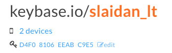
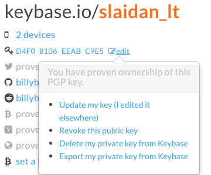

# ChatLab

## Install

    go get golang.org/x/crypto/openpgp

## Setup

### Get Private Key from [Keybase.io](https://keybase.io)

 1. Go to [keybase.io/[your username]](https://keybase.io/)
 2. Click the button edit where it shows a key icon:
 3. Click "Export my private key from Keybase"
 4. Save the key as key.key in the directory where chatlab will run
 5. Save your [keybase.io](https://keybase.io) password as pass.key